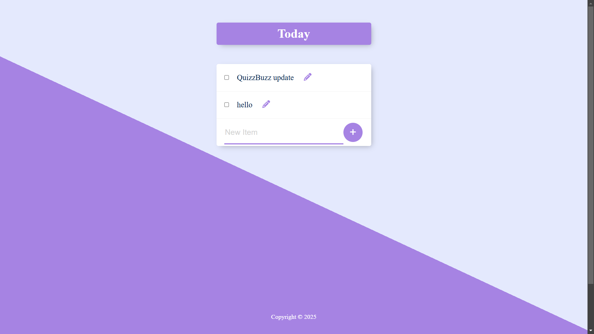

# ✅ Todo List Web App  

## 📌 Overview  
A **simple and efficient Todo List Web App** that helps you organize your tasks. You can **add, edit, delete, and mark tasks as completed**. The app is built with **Node.js, Express, and PostgreSQL** for a backend and uses **HTML, CSS, and JavaScript** for the frontend.  

## 🖼 Screenshot  
  

## 🚀 Features  
- ➕ **Add new tasks**  
- ✅ **Mark tasks as completed**  
- 📝 **Edit tasks**  
- ❌ **Delete tasks**  
- 🔄 **Persist data using PostgreSQL**  
- 🎨 **Simple and clean UI**  

## 🛠 Installation  

### **1️⃣ Clone the Repository**  
```bash
git clone <repo-url>
cd <repo-folder>
